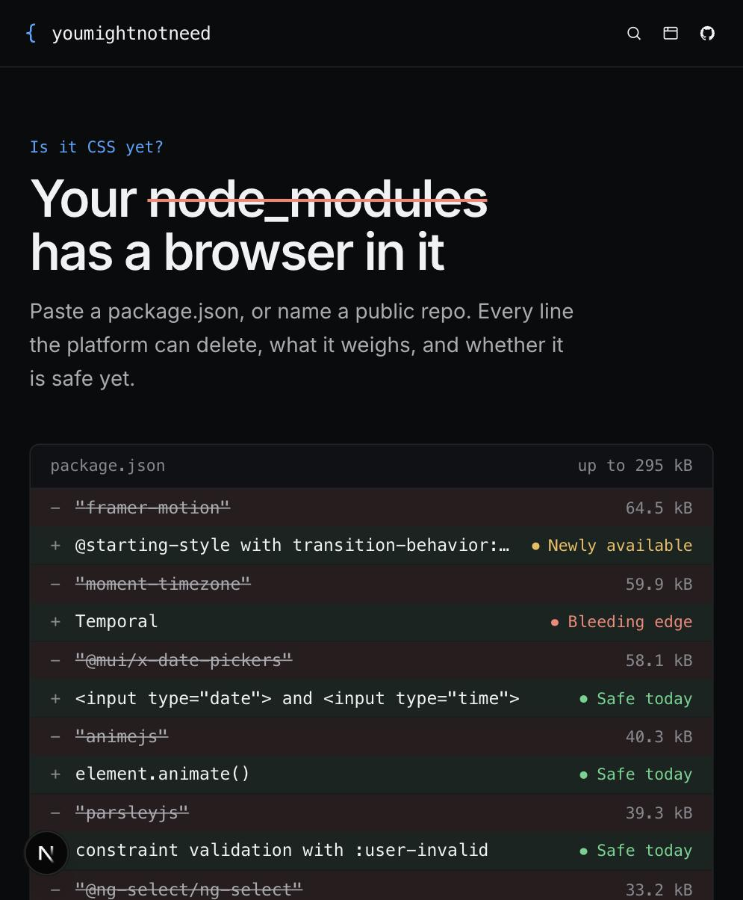
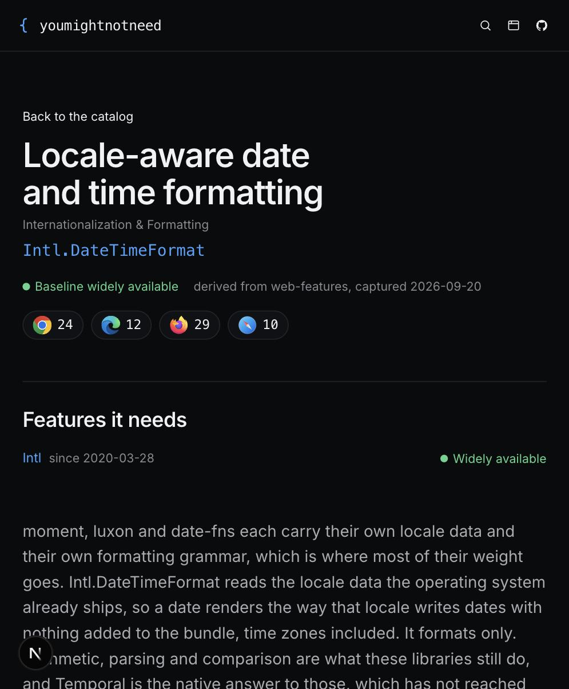
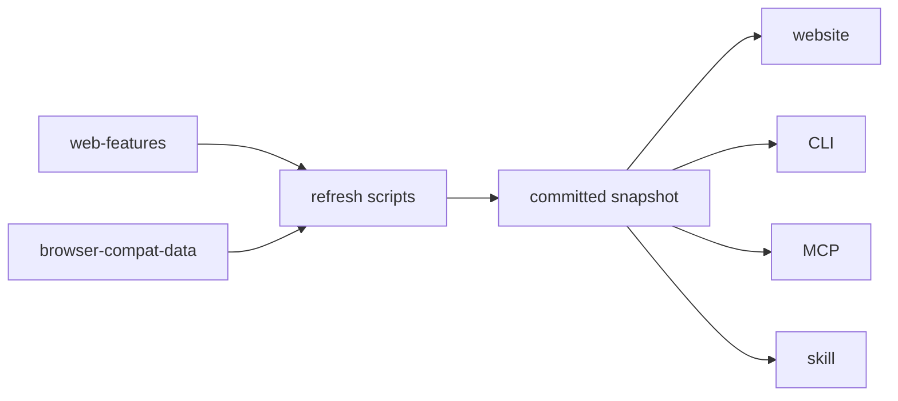

# youmightnotneed

Is it CSS yet?

Find the CSS, HTML, or Web API that replaces your JavaScript dependencies.
One rule catalog, read by a website, a CLI, an MCP server and an agent skill.

[youmightnotneed.dev](https://youmightnotneed.dev)

 

## Start here

```sh
npx youmightnotneed                             # the nearest package.json
npx youmightnotneed --package swiper --verbose  # one package, with conditions
npx youmightnotneed --since 2026-03-01          # only what crossed since then
```

```
  Up to 89.0 kB across 10 dependencies

+ Baseline widely available · safe to use today

  Locale-aware date and time formatting (20.3 kB)
    you have  moment
    native    Intl.DateTimeFormat
    keep it if 5 conditions apply, see --verbose
```

Or paste a `package.json` at the site. Nothing is stored: the report is
encoded in the URL.

For an agent, whichever the host supports:

```sh
npx youmightnotneed-mcp                         # MCP server, over stdio
npx skills add jomaendle/youmightnotneed        # the skill
curl -sS https://youmightnotneed.dev/llms.txt   # or just read it
```

`/plugin marketplace add jomaendle/youmightnotneed` installs the skill and
registers the MCP server in one step.

## What a finding claims

A dependency in `package.json` is not proof of what it is used for. Someone
installs Framer Motion for layout animations, not for fade-ins. So a finding
is a conditional:

> If you're using `swiper` for a horizontal gallery with prev/next and dots,
> CSS scroll-snap with `::scroll-button()` and `::scroll-marker()` covers that
> case.

Every rule carries the conditions where the library is still the right call. A
rule with an empty `unless` list fails the schema, so it cannot be added by
accident. Sizes are "up to", because they assume a full replacement that may
not apply to you.

## What this is not

Three questions sit next to this one and are answered better elsewhere.

| Question | Use |
| --- | --- |
| Is this dependency used at all? | [knip](https://knip.dev) |
| Is this CSS feature too new for my targets? | [Biome `useBaseline`](https://biomejs.dev/linter/rules/use-baseline/css/) |
| Can a linter already find this shape? | [eslint-plugin-unicorn](https://github.com/sindresorhus/eslint-plugin-unicorn), and [/checks](https://youmightnotneed.dev/checks) says which rules |

What is left is the part no linter covers: multi-line behaviour someone wrote
by hand. A focus trap, a scroll lock, a carousel built from scroll listeners.
Nothing is installed for any of it, so no package.json scan finds it either.
Those shapes are on every rule that has them, and the agent skill reads them.

## Where the numbers come from

No browser version and no support tier in this repo is written by hand.



A rule stores `web-features` IDs and a build step turns them into widely,
newly or limited, so every change shows up in a diff. A rule is only as
available as its weakest required feature. Prose works the same way: a rule
writes `{{safari:api.Crypto.randomUUID}}` and `pnpm refresh:support` resolves
it, so a token no source confirms fails the refresh and a typed version fails
the tests.

A rule may also point at Google Chrome's
[modern-web-guidance](https://github.com/GoogleChrome/modern-web-guidance)
(Apache-2.0) by ID for the implementation, and a guide that disappears
upstream fails the freshness check rather than shipping as a dead link.

## Layout

```
packages/catalog   @jomae/catalog, the rules and detect()
packages/cli       npx youmightnotneed
packages/mcp       npx youmightnotneed-mcp
apps/web           youmightnotneed.dev
skills             the agent skill, with a generated catalog reference
scripts            snapshot generators and the freshness check
```

`detect()` is pure: a parsed dependency map in, findings out. No filesystem,
no network, no clock. Every surface calls the same one, which is why they
cannot disagree, and a test asserts it by reading the source.

## Contributing

```sh
pnpm install
pnpm verify      # lint, typecheck, tests, freshness, copy
pnpm dev         # the website
pnpm refresh     # re-snapshot Baseline data, sizes, guides and the skill
```

A rule is one file in `packages/catalog/src/rules/`, exported from the index.
The schema says what is missing; `pnpm verify` says the rest. Write `unless`
first, because an answer that always says "the platform covers it" is worse
than no answer.

`.claude/skills/finding-rules/SKILL.md` covers deciding there is a rule to
write. `.claude/skills/adding-a-rule/SKILL.md` covers writing it. Any change
to a published package wants a changeset: run `pnpm changeset`.

## Licence

MIT. The catalog is the useful part, so take it.
