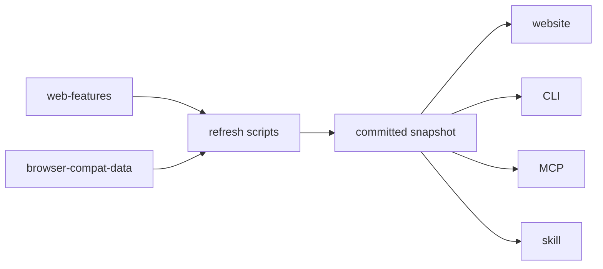

# youmightnotneed

Is it CSS yet?

Find the CSS, HTML, or Web API that replaces your JavaScript dependencies.
One rule catalog, read by a website, a CLI, an MCP server and an agent skill.

[youmightnotneed.dev](https://youmightnotneed.dev)

## Start here

From the command line:

```sh
npx youmightnotneed                             # the nearest package.json
npx youmightnotneed --package swiper --verbose  # one package, with conditions
npx youmightnotneed ./app --json                # machine-readable
```

Or paste a `package.json` at [youmightnotneed.dev](https://youmightnotneed.dev).
Nothing is stored: the report is encoded in the URL.

For an agent, whichever the host supports:

```sh
curl --fail-with-body -sS https://youmightnotneed.dev/llms.txt
curl --fail-with-body -sS https://youmightnotneed.dev/rules/dialog-element.md
npx youmightnotneed-mcp                         # MCP server, over stdio
npx skills add jomaendle/youmightnotneed        # the skill
```

The skill also installs with `/plugin marketplace add jomaendle/youmightnotneed`.

## What a finding claims

A dependency in `package.json` is not proof of what it is used for. Someone
installs Framer Motion for layout animations, not for fade-ins. So a finding is
a conditional:

> If you're using `swiper` for a horizontal gallery with prev/next and dots,
> CSS scroll-snap with `::scroll-button()` and `::scroll-marker()` covers that
> case.

Every rule carries the conditions where the library is still the right call. A
rule with an empty `unless` list fails the schema, so it cannot be added by
accident. Sizes are phrased as "up to", because they assume a full replacement
that may not apply to you.

## What this is not

Three questions sit next to this one and are answered better elsewhere. Naming
them is cheaper than reimplementing them, and the catalog points at the exact
lint rule wherever one already does the job.

| Question | Use |
| --- | --- |
| Is this dependency used at all? | [knip](https://knip.dev) |
| Is this CSS feature too new for my targets? | [Biome `useBaseline`](https://biomejs.dev/linter/rules/use-baseline/css/) |
| Can a linter already find this shape? | [eslint-plugin-unicorn](https://github.com/sindresorhus/eslint-plugin-unicorn), and [youmightnotneed.dev/checks](https://youmightnotneed.dev/checks) says which rules |

What is left over is the part no linter covers: multi-line behaviour someone
wrote by hand. A focus trap, a scroll lock, a carousel built from scroll
listeners. Nothing is installed for any of it, so no package.json scan finds it
either. Those shapes are on every rule that has them, and the agent skill reads
them.

## Where the numbers come from

No browser version and no support tier in this repo is written by hand.



A rule stores `web-features` IDs and a build step turns them into widely, newly
or limited, so every change shows up in a diff. A rule is only as available as
its weakest required feature: tooltips need the Popover API and CSS anchor
positioning, so that rule reads as limited even though half of it is everywhere.

Versions in prose work the same way. A rule writes
`{{safari:api.Crypto.randomUUID}}` and `pnpm refresh:support` resolves it. A
token no source can confirm fails the refresh, and a literal version in a rule
file fails the tests. A review once found seven hand-typed versions the sources
contradicted, every one in the direction that gets someone shipping broken code.

The implementation is someone else's job. A rule may point at Google Chrome's
[modern-web-guidance](https://github.com/GoogleChrome/modern-web-guidance)
(Apache-2.0) by ID, and a guide that disappears upstream fails the freshness
check rather than shipping as a dead link.

## Layout

```
packages/catalog   @jomae/catalog, the rules and detect()
packages/cli       npx youmightnotneed
packages/mcp       npx youmightnotneed-mcp
apps/web           youmightnotneed.dev
skills             the agent skill, with a generated catalog reference
scripts            snapshot generators and the freshness check
```

`detect()` is pure: a parsed dependency map in, findings out. No filesystem, no
network, no clock. Every surface calls the same one, which is why they cannot
disagree, and a test asserts the purity by reading the source.

## Contributing

```sh
pnpm install
pnpm verify      # lint, typecheck, tests, freshness, copy
pnpm dev         # the website
pnpm cli         # the CLI, against this repo
pnpm refresh     # re-snapshot Baseline data, sizes, guides and the skill
```

A rule is one file in `packages/catalog/src/rules/`, exported from the index.
The schema will say what is missing. Four fields need judgement:

- **`unless`** matters most, so write it first. An answer that always says "the
  platform covers it" is worse than no answer. List the cases where you would
  keep the library.
- **`replaces`** takes exact npm names, and each package belongs to one rule
  only, so a report never lists the same dependency twice.
- **`featureIds`** lists only what the replacement *requires*. A feature that
  merely makes the snippet nicer belongs in `unless`.
- **`guides`** is optional. Read the guide before linking it: a plausible ID is
  not evidence, and a review found three pointing at an adjacent topic.

`pnpm test` checks more than the schema. It also checks that no rule tells the
reader to delete anything, that limited-availability rules flag their support
in `unless`, and that the copy follows the house voice in
`.claude/skills/writing-voice/SKILL.md`.

`.claude/skills/adding-a-rule/SKILL.md` has the full method and the worked
examples. Any change to a published package wants a changeset: run
`pnpm changeset`.

## Licence

MIT. The catalog is the useful part, so take it.
